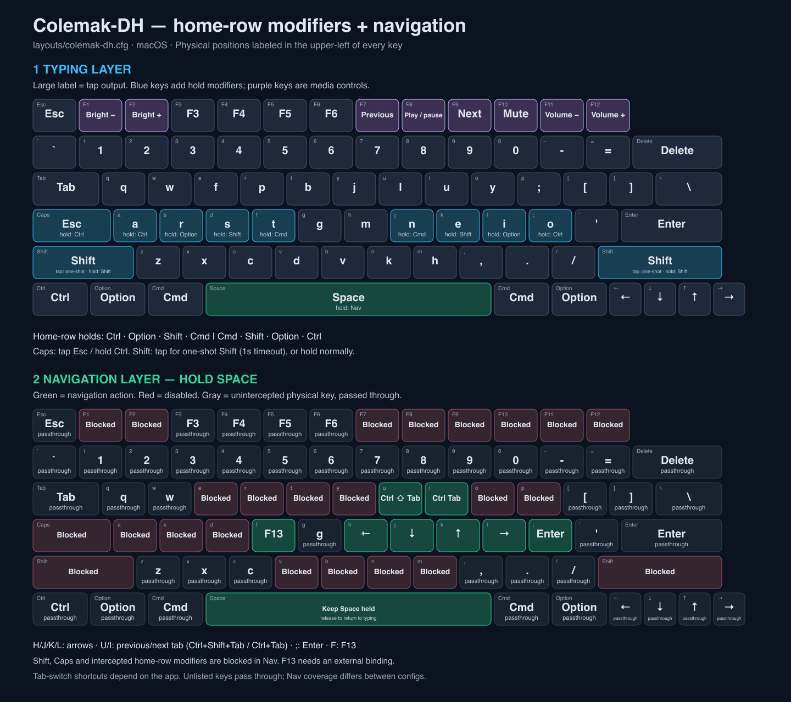
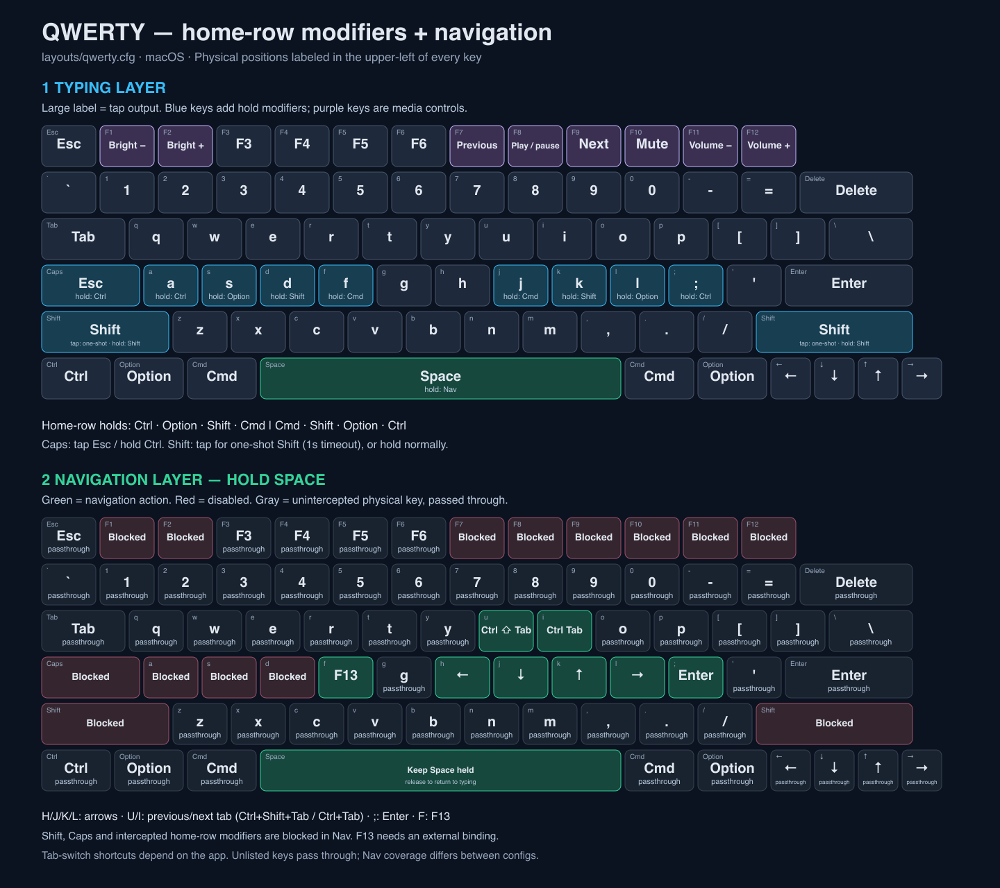

# Space Cadet

Two macOS keyboard layouts for [Kanata](https://github.com/jtroo/kanata): **Colemak-DH** and **QWERTY**, with home-row modifiers and Space-powered navigation.

Tap to type. Hold to modify. Hold Space to navigate.

## Layouts

| Config | Typing layout | Features |
| --- | --- | --- |
| [`layouts/colemak-dh.cfg`](layouts/colemak-dh.cfg) | Colemak-DH | Home-row modifiers, Caps → Escape/Control, one-shot Shift, media controls, Space-held navigation |
| [`layouts/qwerty.cfg`](layouts/qwerty.cfg) | QWERTY | The same modifier positions and navigation shortcuts, without rearranging letters |

Both configs have been validated with Kanata **v1.11.0** on macOS. The setup instructions below target **Apple Silicon**; choose the appropriate binary for other architectures.

### Colemak-DH

```text
Q W F P B   J L U Y ;
A R S T G   M N E I O
Z X C D V   K H , . /
```



### QWERTY

Standard QWERTY letters, with the same hold modifiers and navigation actions at the same physical positions.



In both diagrams, the small upper-left label identifies the **physical QWERTY key position**. The large label shows its output. Blue keys have hold modifiers, purple keys are media controls, and green keys provide navigation. In the navigation layer, red keys are disabled and gray keys pass through.

### Home-row modifiers

Tap these keys for their normal letters; hold them for modifiers:

| Physical QWERTY key | QWERTY tap | Colemak-DH tap | Hold |
| --- | --- | --- | --- |
| A | A | A | Control |
| S | S | R | Option |
| D | D | S | Shift |
| F | F | T | Command |
| J | J | N | Command |
| K | K | E | Shift |
| L | L | I | Option |
| ; | ; | O | Control |

Shift and Command home-row holds use a 200 ms hold timeout; Option and Control use 300 ms. Caps and Space use 200 ms. Tap/hold behavior can take some getting used to; adjust the aliases in the configs if necessary.

Other shared behaviors:

- **Caps Lock:** tap for Escape; hold for Control.
- **Either Shift key:** tap to arm one-shot Shift for the next key (expires after 1 second); hold for ordinary Shift.
- **F1/F2:** brightness down/up.
- **F7/F8/F9:** previous track, play/pause, next track.
- **F10/F11/F12:** mute, volume down, volume up.
- F3–F6 and keys not intercepted by a config pass through normally.

### Space-held navigation

**Tap Space** to type a space. **Hold Space** to activate navigation; release it to return to typing.

These are **physical QWERTY positions**, identical in both configs:

| Key | Navigation action |
| --- | --- |
| H / J / K / L | Left / Down / Up / Right arrows |
| U | Ctrl+Shift+Tab (previous tab in apps that support it) |
| I | Ctrl+Tab (next tab in apps that support it) |
| ; | Enter |
| F | F13 |

F13 has no app-specific action configured here; bind it externally if desired.

**Limitations:** Caps Lock, both Shift keys, and the intercepted home-row modifiers are disabled in navigation. Home-row modifier-assisted selection (such as Shift+Arrow) is therefore not provided by this layer. Physical bottom-row modifiers still pass through. Colemak intercepts more letter keys than QWERTY, so its navigation layer blocks more keys; the diagrams show the exact differences.

## Install on another Mac

### 1. Get this repository

Clone it from its GitHub page, then open a terminal in the cloned `space-cadet` directory. GitHub's **Code** menu provides HTTPS and SSH clone URLs.

### 2. Install Kanata

Download a standard macOS ARM64 binary from the official [Kanata releases](https://github.com/jtroo/kanata/releases). **Kanata binaries are intentionally not included in this repository.**

Prefer the standard build, **not a `cmd_allowed` / command-enabled build**. These layouts do not need external command execution. `cmd` refers to running external programs, not the macOS Command key; normal Command shortcuts do not require it.

Place the download in the repository root as `kanata_macos_arm64`, then make it executable:

```sh
chmod +x ./kanata_macos_arm64
./kanata_macos_arm64 --version
```

Release filenames can differ; rename your downloaded binary to match the commands above. The local binary is ignored by Git. Alternatively, install Kanata on your `PATH` and substitute `kanata` for `./kanata_macos_arm64` in the commands below.

### 3. Install the macOS virtual keyboard driver

Kanata needs [Karabiner-DriverKit-VirtualHIDDevice](https://github.com/pqrs-org/Karabiner-DriverKit-VirtualHIDDevice), with its system extension installed and approved in System Settings. The virtual HID daemon must also be running.

**Match the driver version to your Kanata version.** The upstream macOS guide specifies VirtualHIDDevice **v6.2.0 for Kanata before v1.13.0**, and **v8.0.0 starting with v1.13.0**. Consult the [official macOS setup guide](https://github.com/jtroo/kanata/blob/main/docs/setup-macos.md) and your release's instructions rather than independently upgrading one component.

That guide covers installing/activating the driver and starting its daemon, including standalone-driver installs without Karabiner-Elements.

**Do not run the Karabiner-Elements remapping process alongside Kanata**: they compete for exclusive keyboard access. Keep the required VirtualHIDDevice driver/daemon available.

### 4. Grant macOS permissions

In **System Settings → Privacy & Security**, grant the required **Input Monitoring** and **Accessibility** permissions to Kanata and, if macOS attributes access to it, your terminal app. Follow the upstream setup guide for your Kanata version. Restart the process after granting permissions.

### 5. Validate and run a layout

From the repository root, validate without grabbing the keyboard:

```sh
./kanata_macos_arm64 --check --cfg layouts/qwerty.cfg
./kanata_macos_arm64 --check --cfg layouts/colemak-dh.cfg
```

Then run **one** layout:

```sh
# QWERTY
sudo ./kanata_macos_arm64 --cfg layouts/qwerty.cfg

# Or Colemak-DH (stop the other instance first)
sudo ./kanata_macos_arm64 --cfg layouts/colemak-dh.cfg
```

macOS Kanata requires root access to communicate with the virtual HID daemon. Review configs before running them with `sudo`; neither config enables external command execution.

**Emergency exit:** hold the physical **Left Control + Space + Escape** keys together. You can also stop Kanata with Ctrl+C in its terminal. Stop the active instance before switching layouts.

Start manually before setting up automatic startup. For launch-at-boot setup and troubleshooting, use the [official macOS guide](https://github.com/jtroo/kanata/blob/main/docs/setup-macos.md).

## Updating the diagrams

The editable SVGs and rendered PNGs are in [`images/`](images/). The generator reads the actual configs:

```sh
python3 images/generate-layouts.py
```

To render fresh PNGs, install [librsvg](https://wiki.gnome.org/Projects/LibRsvg) (on macOS: `brew install librsvg`), then run:

```sh
rsvg-convert images/colemak-dh.svg -o images/colemak-dh.png
rsvg-convert images/qwerty.svg -o images/qwerty.png
```

Python and librsvg are only needed to regenerate diagrams, not to run the layouts.

## Repository contents

```text
layouts/
  colemak-dh.cfg       Colemak-DH configuration
  qwerty.cfg           QWERTY configuration
images/
  colemak-dh.{svg,png} Colemak-DH visual reference
  qwerty.{svg,png}     QWERTY visual reference
  generate-layouts.py  Config-driven SVG generator
AGENTS.md             Shared coding-agent guidance
CLAUDE.md             Imports AGENTS.md for Claude Code
```

Local binaries, downloaded packages, and machine-local agent settings are excluded from Git.
